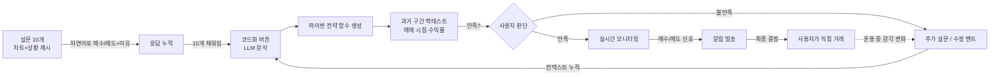
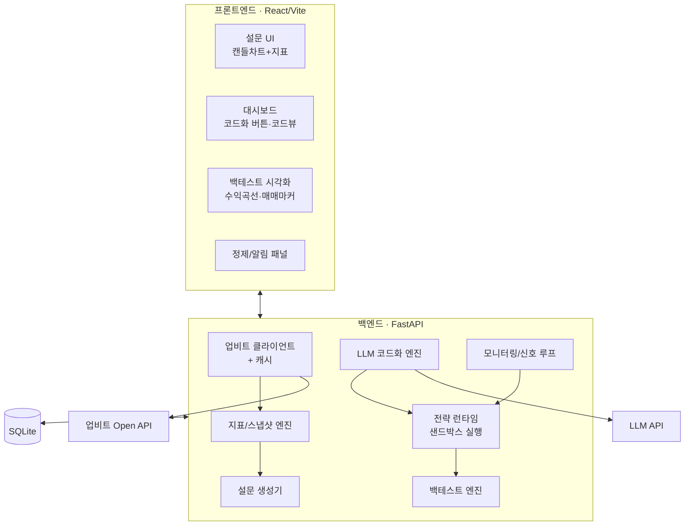

# 개발 계획서 — (가칭) **Tacit Trader**
### 내 암묵지를 파이썬 매매 전략으로 변환하는 웹앱

> 대상: 1~2일 해커톤 · 플랫폼: 웹앱 · 팀: 풀스택 4인 · 데이터: 업비트 Open API

---

## 0. 한 줄 요약

차트를 하루 종일 볼 시간이 없는 사람이, **설문에 자연어로 답하는 것만으로** 자신의 매매 암묵지를 파이썬 전략 코드로 자동 변환하고, **백테스트로 검증**한 뒤, 매수/매도 타이밍에 **알림만 받고 최종 결정은 본인이** 하는 도구.

---

## 1. 문제 & 솔루션

**문제.** 매매 감각(암묵지)은 있지만 (1) 사람이 직접 코드로 못 옮기고, (2) 자연어로 자세히 설명하기도 어렵다. 그렇다고 차트를 종일 볼 수도 없다.

**솔루션.** "차트를 보고 살지/팔지 + 이유"를 자연어로 답하는 **설문**을 모아 → **LLM이 한 번에 분석해 전략 함수(파이썬)로 코드화** → **백테스트로 본인 감각과 맞는지 스스로 확인** → 불만족 시 설문/수정 멘트를 더 쌓아 **재코드화** → 완성된 전략은 **실시간 신호 알림**으로 운용(최종 결정은 사용자).

**핵심 차별점.** 지표 임계값을 사람이 정하지 않는다. "왜 사고 싶었는지"라는 **자연어 + 그 시점의 숫자(지표 스냅샷)** 쌍에서 LLM이 규칙을 역설계한다.

---

## 2. 핵심 사용자 플로우



전 과정에서 **사람은 거래를 직접 하지 않는다** — 우리 앱은 분석·알림까지만 하고 주문은 사용자 몫. 덕분에 업비트 **거래 API 인증/주문 기능이 불필요**하고(읽기 전용 시세만 사용), 해커톤 난이도와 리스크가 크게 낮아진다.

---

## 3. 시스템 아키텍처



데이터 흐름 한 줄 요약: **업비트 캔들 → 지표 스냅샷 → (설문/백테스트/실시간) 동일 피처 → 전략 함수 `decide()` → 신호.** 설문·백테스트·실시간이 *같은 피처/같은 함수*를 쓰는 게 설계의 핵심이라 코드 재사용률이 높다.

---

## 4. 기술 스택

| 영역 | 선택 | 이유 |
|---|---|---|
| 프론트 | React + Vite, TypeScript | 빠른 셋업, 컴포넌트 분담 용이 |
| 차트 | **lightweight-charts** (TradingView) | 캔들+마커+오버레이를 가볍게. Recharts는 수익곡선용 보조 |
| 백엔드 | **FastAPI (Python)** | 전략이 파이썬 → 코드화·백테스트·실시간이 한 언어로 통일 |
| 데이터 처리 | pandas, numpy | 지표 계산·백테스트 |
| LLM | OpenAI/Anthropic API | 코드 생성. 함수 시그니처 고정으로 출력 안정화 |
| DB | **SQLite** | 해커톤 최적. 서버 1개, 파일 1개 |
| 알림 | 인앱 + **Telegram/Discord 웹훅** | 별도 앱/푸시 인프라 없이 즉시 데모 가능 |
| 배포 | 로컬 + ngrok (데모용) | 무박 해커톤은 배포보다 데모 안정성 우선 |

> 파이썬을 백엔드로 고정하는 게 이 프로젝트의 가장 중요한 스택 결정이다. "코드화 결과 = 파이썬"인데 백엔드가 다른 언어면 생성 코드를 실행할 런타임을 따로 만들어야 해서 1~2일 안에 불가능에 가깝다.

---

## 5. 데이터: 업비트 Open API 연동

**전부 시세(Quotation) 엔드포인트만 사용 → 인증/키 불필요(읽기 전용).** 주문은 안 하므로 거래 API는 쓰지 않는다.

| 용도 | 엔드포인트 | 비고 |
|---|---|---|
| 마켓 목록 | `GET /v1/market/all` | KRW-BTC 등 코드 확보 |
| 분 캔들 | `GET /v1/candles/minutes/{unit}` | unit ∈ {1,3,5,10,15,30,60,240} |
| 일/주/월 캔들 | `GET /v1/candles/days`, `/weeks`, `/months` | 백테스트 장기 구간용 |
| 현재가(실시간 폴링) | `GET /v1/ticker?markets=KRW-BTC` | 모니터링 루프에서 사용 |

**연동 규칙 (반드시 지킬 것)**

- **count 최대 200개/요청.** 더 긴 과거는 `to`(기준 시각) 파라미터로 **페이지네이션**해서 이어 받는다.
- **레이트 리밋: 시세 API 초당 약 10회.** 클라이언트에 **토큰버킷/세마포어로 throttle** 필수. 초과 시 429.
- **캐싱 필수.** 한 번 받은 캔들은 SQLite(또는 메모리)에 저장 후 재사용. 설문·백테스트가 같은 구간을 반복 조회하므로 캐시가 속도·리밋 둘 다 해결.
- 거래 없는 구간엔 캔들이 안 생긴다 → 결측 봉 처리(앞값 보정 또는 스킵) 로직 둘 것.
- 시각은 UTC/KST 혼선 주의(`candle_date_time_kst` 사용 권장).

**예시 호출**
```bash
curl 'https://api.upbit.com/v1/candles/minutes/15?market=KRW-BTC&count=200'
# 더 과거: &to=2026-06-01T00:00:00+09:00 로 200개씩 이어받기
```

---

## 6. 핵심 설계 결정 (성패를 가르는 5가지)

**① 설문 = 차트 그림 + "구조화된 지표 스냅샷"을 함께 저장한다.**
사용자에겐 차트를 보여주지만, 백엔드는 그 시점의 숫자(RSI, 이동평균 이격, 거래량비 등)를 함께 기록한다. LLM은 "RSI 28에서 반등 노려 매수"처럼 **자연어를 숫자에 앵커링**해야 임계값이 있는 코드를 만들 수 있다. *이 스냅샷이 없으면 전체 아이디어가 동작하지 않는다.*

**② LLM은 자유 코드가 아니라 "고정 인터페이스 전략 함수"를 생성한다.**
출력 형식을 아래 `decide()` 한 함수로 강제 → 백테스트·실시간이 **같은 코드를 그대로 재사용**, 파싱/실행이 안정적, 안전성 확보 용이.

**③ 컨텍스트 누적 + 버전 관리.**
모든 응답·수정 멘트를 시간순 컨텍스트로 쌓는다. "코드화" 버튼은 *그 시점까지 누적된 전체 컨텍스트*로 코드를 재생성하고 새 버전을 만든다. 운용 중 수정 멘트도 같은 컨텍스트에 append → 재코드화.

**④ 자기일관성 검증(신뢰 점수).**
생성된 전략을 **설문 10개 시점에 직접 돌려** 사용자의 실제 매수/매도와 얼마나 일치하는지(%)를 보여준다. "당신 감각의 82%를 재현"같은 지표 → 신뢰도 + 어디가 어긋났는지 자동 피드백.

**⑤ 설문도 백테스트도 "미래를 가린 과거 구간"으로 통일.**
설문 = 과거 랜덤 구간을 결정 시점까지만 보여주고 미래를 가림. 백테스트 = 과거 구간 전체에 전략 적용. **둘이 같은 데이터 파이프라인** → 코드 재사용 + 데이터 일관성.

> 안전장치: LLM 생성 코드는 **제한된 네임스페이스(허용 빌트인만)+타임아웃**으로 실행. 파일/네트워크/`import` 차단. (스트레치: 별도 프로세스 샌드박스)

---

## 7. 데이터 모델 (SQLite)

| 테이블 | 핵심 컬럼 | 설명 |
|---|---|---|
| `markets` | code, korean_name | 코인 목록 캐시 |
| `candles` | market, unit, ts, o,h,l,c,v | 캔들 캐시(중복 방지 유니크 키) |
| `surveys` | id, market, decision_ts, chart_payload, **features_json** | 설문 1건(미래 가림 구간 + 지표 스냅샷) |
| `responses` | id, survey_id, action(BUY/SELL/HOLD), reasoning_text, created_at | 사용자 자연어 응답 |
| `context_log` | id, type(response/correction), content, created_at | LLM에 넣을 누적 컨텍스트(시간순) |
| `strategy_versions` | id, version, code_text, prompt_used, created_at | 생성된 전략 코드 버전 이력 |
| `backtest_results` | id, version, market, period, metrics_json, trades_json, equity_json | 백테스트 결과 |

---

## 8. 통합 계약 (★ H0~H1에 4명이 함께 확정 ★)

> 풀스택 4인이 **병렬로** 일하려면 "경계면(인터페이스)"부터 못 박아야 한다. 아래 두 계약을 먼저 합의하면 각자 목업으로 독립 개발이 가능하다.

**(A) 전략 함수 계약 — 모든 부분의 중심**
```python
def decide(features: dict, position: dict) -> dict:
    """
    features: 현 시점 지표 스냅샷
      예) {"close":..., "ret_1":..., "ret_5":...,
           "ma5":..., "ma20":..., "ma60":..., "ma_align": "정배열|역배열|혼조",
           "rsi14":..., "macd":..., "macd_signal":...,
           "bb_pct":..., "bb_width":..., "atr":...,
           "vol_ratio":...,            # 거래량 / 거래량MA
           "dist_from_high20":..., "dist_from_low20":...}
    position: {"holding": bool, "entry_price": float|None, "pnl_pct": float}
    return : {"action": "BUY"|"SELL"|"HOLD", "reason": str}
    """
```
이 시그니처를 **A(피처 생성)·B(코드 생성)·C(백테스트)·D(실시간)** 가 전부 공유한다.

**(B) REST API 계약 (FastAPI)**

| 메서드/경로 | 입력 → 출력 | 담당 |
|---|---|---|
| `GET /api/markets` | → 코인 목록 | A |
| `POST /api/surveys/generate` | {market?, n=10} → 설문 N개(차트+스냅샷, 미래 가림) | A |
| `GET /api/surveys/{id}` | → 설문 단건 | A |
| `POST /api/responses` | {survey_id, action, reasoning} → ok | B |
| `POST /api/strategy/codify` | (누적 컨텍스트 사용) → {version, code} | B |
| `POST /api/strategy/refine` | {correction_text} → ok(컨텍스트 누적) | B |
| `GET /api/strategy/{version}` | → 코드+메타 | B |
| `POST /api/backtest` | {version, market, period} → {metrics, trades, equity} | C |
| `GET /api/strategy/{version}/consistency` | → 설문 대비 일치율 | C |
| `GET /api/monitor/signal` | {version, market} → 현재 신호 | D |
| `POST /api/alerts/test` | {webhook_url} → 발송 테스트 | D |

JSON 스키마(필드명/타입)는 H1에 한 파일(`contracts.md` 또는 pydantic 모델)로 고정.

---

## 9. 4인 파트 분배 (풀스택, 기능 수직 분할)

각자 "백엔드 엔드포인트 + 그에 붙는 프론트 일부"를 함께 갖는 수직 슬라이스. 경계는 8장 계약으로 분리.

### Part A — 데이터 & 설문 엔진
- 업비트 클라이언트(캔들/티커, throttle, 페이지네이션, 캐시)
- **지표/스냅샷 엔진**: 한 시점의 `features` dict 생성 (모두가 쓰는 공통 모듈)
- 설문 생성기: 과거 랜덤 구간 선택 → 결정 시점까지 차트 payload + 미래 가림
- 엔드포인트: `/markets`, `/surveys/*`
- **산출물이 모두의 입력** → H0~H6에 `features` 스키마부터 먼저 확정해 다른 파트 언블록.

### Part B — LLM 코드화 & 전략 런타임
- 프롬프트 설계: 누적 컨텍스트(응답+스냅샷+수정멘트) → `decide()` 함수 생성
- 출력 파싱·검증, **샌드박스 실행기**(제한 네임스페이스+타임아웃)
- 컨텍스트 누적/버전 관리 로직
- 엔드포인트: `/responses`, `/strategy/codify`, `/strategy/refine`, `/strategy/{ver}`

### Part C — 백테스트 & 검증
- 백테스트 러너: 구간 순회 → 매 시점 `features` 만들어 `decide()` 호출 → 매매 시뮬
- 지표: 총수익률, 승률, 거래수, MDD, **vs 보유전략(Buy&Hold)**
- **자기일관성 검증**(설문 시점 일치율)
- 백테스트 결과 API + 프론트 시각화용 데이터(수익곡선/매매마커)
- 엔드포인트: `/backtest`, `/strategy/{ver}/consistency`

### Part D — 프론트 통합 & 실시간/알림
- 앱 셸·라우팅·상태관리, 설문 UI(캔들차트+지표 오버레이+자연어 입력)
- 대시보드(진행도 X/10, **코드화 버튼**, 코드 뷰어), 백테스트 결과 화면, 정제 패널
- **실시간 모니터링 루프**(티커 폴링 → `decide()` → 신호) + 알림(인앱/웹훅), 최종 결정 사용자 위임
- 엔드포인트: `/monitor/signal`, `/alerts/*`

> 의존성 순서: **A(피처/계약) → B·C·D**. 그래서 A는 첫 6시간에 `features` 모듈과 더미 설문을 최우선으로 내보내고, B·C·D는 그 전까지 **목업 데이터로 병렬 진행**.

---

## 10. 타임라인 (약 30시간 작업창 기준 · 1박2일)

| 단계 | 시간 | 마일스톤 | A | B | C | D |
|---|---|---|---|---|---|---|
| **0 킥오프** | H0–H2 | 계약 확정·레포·스캐폴딩·더미데이터 | 업비트 호출 PoC | LLM 1콜 PoC | 백테스트 뼈대 | 프론트 셸+차트 렌더 |
| **1 독립 구현** | H2–H10 | 각 파트 목업 기반 동작 | features 모듈+설문생성 | codify→decide 생성 | 더미 전략 백테스트 | 설문 UI+코드화 버튼 |
| **2 1차 통합** | H10–H18 | **설문→응답→코드화→백테스트 E2E** | 실데이터 캐시 연결 | 컨텍스트 누적·버전 | 실전략 백테스트+지표 | 결과 시각화 연결 |
| **3 정제·실시간** | H18–H26 | 수정 루프+신호 알림+일관성 | 결측/리밋 안정화 | refine 재코드화 | 일관성 검증·vs B&H | 모니터링 폴링+웹훅 |
| **4 데모 준비** | H26–H30 | 시드데이터·폴백·리허설·발표자료 | 데모용 구간 고정 | 캐시된 코드 폴백 | 보기 좋은 결과 1건 고정 | 데모 시나리오·녹화 |

**필수 통과 게이트**: H18에 **E2E 1회 성공**(설문→코드→백테스트)이 안 되면 스트레치 전부 버리고 이 루프 완성에 전원 투입.

**1일(무박) 압축 버전**: 단계 3을 "신호 1개 + 인앱 알림"으로 축소, 단계 0~2에 집중. refine/웹훅/일관성은 스트레치로.

---

## 11. MVP 범위 vs 스트레치

| 반드시(MVP) | 여유되면(스트레치) |
|---|---|
| 설문 10개 생성·응답·누적 | 코인 다종목·여러 시간프레임 |
| 코드화(`decide()` 생성)·코드 뷰 | 별도 프로세스 샌드박스 실행 |
| 과거 구간 백테스트(수익률·매매마커·vs 보유) | 수수료/슬리피지 정밀 반영 |
| "코드화" 재생성(컨텍스트 누적) | 자기일관성 % + 어긋난 설문 하이라이트 |
| 실시간 신호 1개 + 알림(인앱 or 웹훅) | 텔레그램/디스코드 실알림, 스케줄러 상시 가동 |
| 수정 멘트 → 재코드화 | 전략 버전 비교(diff)·A/B 백테스트 |

---

## 12. 리스크 & 데모 대비책

| 리스크 | 대비책 |
|---|---|
| LLM이 깨진/위험한 코드 생성 | 함수 시그니처 강제 + 파싱검증 + 실패 시 직전 버전 폴백, 실행 타임아웃 |
| 업비트 레이트리밋/네트워크 | throttle + 캐시, **데모 구간 캔들은 미리 받아 고정** |
| LLM API 지연/실패 | 데모용으로 **검증된 코드 1개를 캐시**해 즉시 시연 가능하게 |
| 무박 시간 부족 | H18 게이트 우선, 스트레치 즉시 포기 규칙 |
| "코드가 감각과 다름" 시연 위험 | 미리 **만족스러운 결과가 나오는 종목/구간을 픽스**해 리허설 |
| 통합 충돌 | 8장 계약을 H1에 동결, 변경은 4명 합의 시에만 |

---

## 13. 데모 시나리오 (3분 발표용)

1. **30초** — "차트 볼 시간 없는데 감은 있다"는 문제 제기.
2. **60초** — 설문 2~3개에 자연어로 답("거래량 터지고 RSI 낮아서 매수"). 진행도 채워짐.
3. **30초** — **코드화 버튼** 클릭 → 생성된 `decide()` 코드가 화면에.
4. **45초** — 백테스트 실행 → 수익곡선·매수/매도 마커·"보유 대비 +X%"·일관성 82%.
5. **15초** — 수정 멘트 한 줄 → 재코드화로 코드가 바뀌는 것 시연.
6. **마무리** — 실시간 신호 알림 화면(텔레그램 메시지) → "알림만, 결정은 사람."

---

## 부록: 빠른 시작

```bash
# 백엔드
python -m venv venv && source venv/bin/activate
pip install fastapi uvicorn pandas numpy requests httpx python-dotenv openai
uvicorn app.main:app --reload

# 프론트
npm create vite@latest web -- --template react-ts
cd web && npm i lightweight-charts recharts axios && npm run dev

# 데모 노출(선택)
ngrok http 8000
```

**첫 1시간 체크리스트**: ① 레포/브랜치 전략 ② `contracts.md`에 8장 두 계약 확정 ③ `.env`(LLM 키) ④ 업비트 캔들 1회 수신 성공 ⑤ 더미 `decide()`로 백테스트 1회 통과 ⑥ 프론트에 캔들 1개 렌더.
